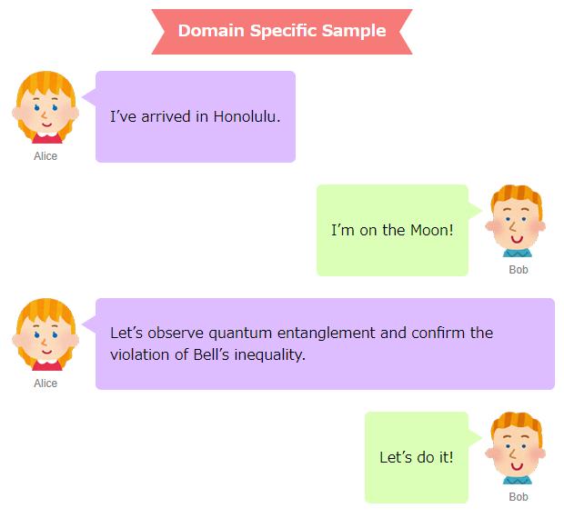

Munyo is a data language. You can create a domain-specific language with just a little coding.

```
H3 Domain Specific Sample|class ribbon1

Alice I’ve arrived in Honolulu.
Bob I’m on the Moon!
Alice Let’s observe quantum entanglement and confirm the violation of Bell’s inequality.
Bob Let’s do it!
```
↑ Munyo source file.



↑ HTML created from the source file.

```Rust
use crate::{
    samples::html_samples::html_builder::{HtmlItem, Param, Tag},
    RestOf,
};
use serde::{Deserialize, Serialize};

#[derive(Serialize, Deserialize)]
pub enum Tags {
    Alice(RestOf),
    Bob(RestOf),
    H3(RestOf, Class),
}

#[derive(Serialize, Deserialize)]
pub struct Class {
    pub class: String,
}

pub fn to_html_items(items: &[Tags]) -> Vec<HtmlItem> {
    let mut r: Vec<HtmlItem> = vec![];
    for item in items {
        match item {
            Tags::Alice(t) => {
                balloon(true, &t.arg, &mut r);
            }
            Tags::Bob(t) => {
                balloon(false, &t.arg, &mut r);
            }
            Tags::H3(t, c) => {
                r.push(tag("h3", class(c), vec![text(&t.arg)]));
            }
        }
    }
    r
}

fn balloon(is_l: bool, text: &str, r: &mut Vec<HtmlItem>) {
    let bl = if is_l { "balloonL" } else { "balloonR" };
    let pict = if is_l { "girl.png" } else { "boy.png" };
    let speaker = if is_l { "Alice" } else { "Bob" };
    let t = format!(
        r###"
<div class="balloon {}">
  <div class="balloon-img"><figure><figcaption>{}</figcaption></figure></div>
  <div class="balloon-text"><div class="balloon-text-inner">
  {}
  </div></div>
</div>"###,
        bl, pict, speaker, text
    );
    r.push(self::text(&t))
}

fn tag(name: &str, params: Vec<Param>, children: Vec<HtmlItem>) -> HtmlItem {
    HtmlItem::Tag(Tag::new(name.to_string(),params),children)
}

fn text(s: &str) -> HtmlItem {
    HtmlItem::Text(s.to_string())
}

fn class(class: &Class) -> Vec<Param> {
    vec![Param::new("class".to_string(), class.class.clone())]
}

fn test() -> crate::Result<()> {
    use super::super::html_builder::HtmlBuilder;
    use crate::from_file;
    use crate::samples::html_samples::sample3::tags::{to_html_items, Tags};

    let path = "src/samples/html_samples/sample3/sample3.munyo";
    let v: Vec<Tags> = from_file(path)?;
    let b = HtmlBuilder {
        items: to_html_items(&v),
        title: "Sample3".to_string(),
        stylesheet: Some("sample.css".to_string()),
        ..Default::default()
    };
    let output = b.to_string();
    std::fs::write("src/samples/html_samples/sample3/output.html", output).unwrap();
    Ok(())
}
```

↑ The code to generate HTML

The goal of this language is to be the most efficient way to handwrite data.